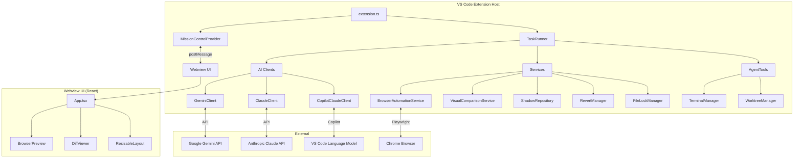
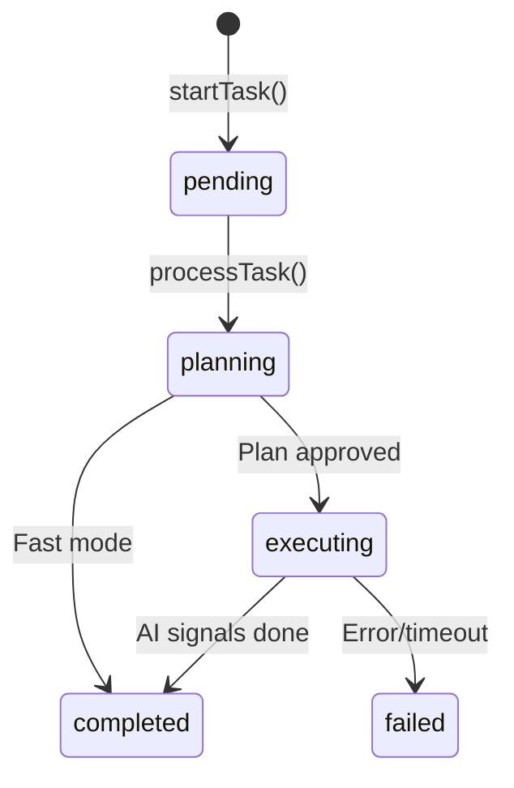

# Workspace Constitution

Generated automatically for: VSCODE-EXT

This constitution defines the rules and patterns for this workspace.

## Project Metadata

### package.json

```
{
    "name": "vibearchitect",
    "displayName": "VibeArchitect Agent Manager",
    "description": "VibeArchitect - AI Agent Manager Extension",
    "version": "0.0.1",
    "engines": {
        "vscode": "^1.85.0"
    },
    "categories": [
        "Other"
    ],
    "activationEvents": [
        "onCommand:vibearchitect.openMissionControl"
    ],
    "main": "./dist/extension.js",
    "contributes": {
        "commands": [
            {
                "command": "vibearchitect.openMissionControl",
                "title": "VibeArchitect: Open Mission Control"
            }
        ],
        "configuration": {
            "title": "VibeArchitect",
            "properties": {
                "vibearchitect.geminiApiKey": {
                    "type": "string",
                    "default": "",
                    "description": "Google GenAI API Key for Gemini 3 Pro"
                },
                "vibearchitect.claudeApiKey": {
                    "type": "string",
                    "default": "",
                    "description": "Anthropic API Key for Claude Opus 4.5"
                },
                "vibearchitect.useCopilotForClaude": {
                    "type": "boolean",
                    "default": false,
                    "description": "Use GitHub Copilot subscription for Claude instead of API key (requires Copilot extensions)"
                },
                "vibearchitect.browserRecordingsPath": {
                    "type": "string",
                    "default": "",
                    "description": "Custom path for storing browser test recordings. Leave empty to use default (workspace/.vibearchitect/recordings)"
                },
                "vibearchitect.browserSelfHealingRetries": {
                    "type": "number",
                    "default": 3,
                    "minimum": 1,
                    "maximum": 10,
                    "description": "Number of retry attempts for self-healing UI tests"
                }
            }
        }
    },
    "scripts": {
        "vscode:prepublish": "npm run package",
        "compile": "webpack",
        "watch": "webpack --watch",
        "package": "webpack --mode production --devtool hidden-source-map",
        "compile-tests": "tsc -p . --outDir out",
        "watch-tests": "tsc -p . -w --outDir out",
        "pretest": "npm run compile-tests && npm run compile && npm run lint",
        "lint": "eslint src --ext ts",
        "test": "node ./out/test/runTest.js",
        "install:all": "npm install && cd webview-ui && npm install",
        "build:all": "npm run compile && cd webview-ui && npm run build",
        "setup": "npm run install:all && npm run build:all",
        "install-browsers": "npx playwright install chromium"
    },
    "devDependencies": {
        "@types/fs-extra": "^11.0.4",
        "@types/glob": "^8.1.0",
        "@types/mocha": "^10.0.6",
        "@types/node": "20.x",
        "@types/pixelmatch": "^5.2.6",
        "@types/pngjs": "^6.0.5",
        "@types/vscode": "^1.85.0",
        "@typescript-eslint/eslint-plugin": "^6.15.0",
        "@typescript-eslint/parser": "^6.15.0",
        "@vscode/test-electron": "^2.3.8",
        "eslint": "^8.56.0",
        "glob": "^8.1.0",
        "mocha": "^10.2.0",
        "ts-loader": "^9.5.1",
        "typescript": "^5.3.3",
        "webpack": "^5.89.0",
        "webpack-cli": "^5.1.4"
    },
    "dependencies": {
        "@anthropic-ai/sdk": "^0.39.0",
        "@google/genai": "^1.34.0",
        "@google/generative-ai": "^0.24.1",
        "fs-extra": "^11.2.0",
        "pixelmatch": "^5.3.0",
        "playwright-core": "^1.40.0",
        "pngjs": "^7.0.0",
        "simple-git": "^3.22.0"
    }
}

```

### package-lock.json

```
{
    "name": "vibearchitect",
    "version": "0.0.1",
    "lockfileVersion": 3,
    "requires": true,
    "packages": {
        "": {
            "name": "vibearchitect",
            "version": "0.0.1",
            "dependencies": {
                "@anthropic-ai/sdk": "^0.39.0",
                "@google/genai": "^1.34.0",
                "@google/generative-ai": "^0.24.1",
                "fs-extra": "^11.2.0",
                "pixelmatch": "^5.3.0",
                "playwright-core": "^1.40.0",
                "pngjs": "^7.0.0",
                "simple-git": "^3.22.0"
            },
            "devDependencies": {
                "@types/fs-extra": "^11.0.4",
                "@types/glob": "^8.1.0",
                "@types/mocha": "^10.0.6",
                "@types/node": "20.x",
                "@types/pixelmatch": "^5.2.6",
                "@types/pngjs": "^6.0.5",
                "@types/vscode": "^1.85.0",
                "@typescript-eslint/eslint-plugin": "^6.15.0",
                "@typescript-eslint/parser": "^6.15.0",
                "@vscode/test-electron": "^2.3.8",
                "eslint": "^8.56.0",
                "glob": "^8.1.0",
                "mocha": "^10.2.0",
                "ts-loader": "^9.5.1",
                "typescript": "^5.3.3",
                "webpack": "^5.89.0",
                "webpack-cli": "^5.1.4"
            },
            "engines": {
                "vscode": "^1.85.0"
            }
        },
        "node_modules/@anthropic-ai/sdk": {
            "version": "0.39.0",
            "resolved": "https://registry.npmjs.org/@anthropic-ai/sdk/-/sdk-0.39.0.tgz",
            "integrity": "sha512-eMyDIPRZbt1CCLErRCi3exlAvNkBtRe+kW5vvJyef93PmNr/clstYgHhtvmkxN82nlKgzyGPCyGxrm0JQ1ZIdg==",
            "license": "MIT",
            "dependencies": {
                "@types/node": "^18.11.18",
                "@types/node-fetch": "^2.6.4",
                "abort-controller": "^3.0.0",
                "agentkeepalive": "^4.2.1",
                "form-data-encoder": "1.7.2",
                "formdata-node": "^4.3.2",
                "node-fetch": "^2.6.7"
            }
        },
        "node_modules/@anthropic-ai/sdk/node_modules/@types/node": {
            "version": "18.19.130",
            "resolved": "https://registry.npmjs.org/@types/node/-/node-18.19.130.tgz",
            "integrity": "sha512-GRaXQx6jGfL8sKfaIDD6OupbIHBr9jv7Jnaml9tB7l4v068PAOXqfcujMMo5PhbIs6ggR1XODELqahT2R8v0fg==",
            "license": "MIT",
            "dependencies": {
                "undici-types": "~5.26.4"
            }
        },
        "node_modules/@anthropic-ai/sdk/node_modules/node-fetch": {
            "version": "2.7.0",
            "resolved": "https://registry.npmjs.org/node-fetch/-/node-fetch-2.7.0.tgz",
            "integrity": "sha512-c4FRfUm/dbcWZ7U+1Wq0AwCyFL+3nt2bEw05wfxSz+DWpWsitgmSgYmy2dQdWyKC1694ELPqMs/YzUSNozLt8A==",
            "license": "MIT",
            "dependencies": {
                "whatwg-url": "^5.0.0"
            },
            "engines": {
                "node": "4.x || >=6.0.0"
            },
            "peerDependencies": {
                "encoding": "^0.1.0"
            },
            "peerDependenciesMeta": {
                "encoding": {
                    "optional": true
                }
            }
        },
        "node_modules/@anthropic-ai/sdk/node_modules/undici-types": {
            "version": "5.26.5",
            "resolved": "https://registry.npmjs.org/undici-types/-/undici-types-5.26.5.tgz",
            "integrity": "sha512-JlCMO+ehdEIKqlFxk6IfVoAUVmgz7cU7zD/h9XZ0qzeosSHmUJVOzSQvvYSYWXkFXC+IfLKSIffhv0sVZup6pA==",
            "license": "MIT"
        },
        "node_modules/@discoveryjs/json-ext": {
            "version": "0.5.7",
            "resolved": "https://registry.npmjs.org/@discoveryjs/json-ext/-/json-ext-0.5.7.tgz",
            "integrity": "sha512-dBVuXR082gk3jsFp7Rd/JI4kytwGHecnCoTtXFb7DB6CNHp4rg5k1bhg0nWdLGLnOV71lmDzGQaLMy8iPLY0pw==",
            "dev": true,
            "license": "MIT",
            "engines": {
                "node": ">=10.0.0"
            }
        },
        "node_modules/@eslint-community/eslint-utils": {
            "version": "4.9.0",
            "resolved": "https://registry.npmjs.org/@eslint-community/eslint-utils/-/eslint-utils-4.9.0.tgz",
            "integrity": "sha512-ayVFHdtZ+hsq1t2Dy24wCmGXGe4q9Gu3smhLYALJrr473ZH27MsnSL+LKUlimp4BWJqMDMLmPpx/Q9R3OAlL4g==",
            "dev": true,
            "license": "MIT",
            "dependencies": {
                "eslint-visitor-keys": "^3.4.3"
            },
            "engines": {
                "node": "^12.22.0 || ^14.17.0 || >=16.0.0"
            },
            "funding": {
                "url": "https://opencollective.com/eslint"
            },
            "peerDependencies": {
                "eslint": "^6.0.0 || ^7.0.0 || 
... [truncated]
```

### tsconfig.json

```
{
    "compilerOptions": {
        "module": "Node16",
        "target": "ES2022",
        "outDir": "out",
        "lib": [
            "ES2022"
        ],
        "sourceMap": true,
        "rootDir": "src",
        "strict": true, /* enable all strict type-checking options */
        /* Additional Checks */
        "noImplicitReturns": true,
        "noFallthroughCasesInSwitch": true,
        /* Module Resolution Options */
        "moduleResolution": "Node16", // VSCode extensions run in Node
        "esModuleInterop": true,
        "skipLibCheck": true,
        "forceConsistentCasingInFileNames": true
    },
    "exclude": [
        "node_modules",
        ".vscode-test",
        "webview-ui"
    ]
}
```

### webpack.config.js

```
/* eslint-disable @typescript-eslint/no-var-requires */
const path = require('path');
const webpack = require('webpack');

/** @typedef {import('webpack').Configuration} WebpackConfig */

/** @type WebpackConfig */
const extensionConfig = {
    mode: 'none', // this leaves the source code as close as possible to the original (when packaging we set this to 'production')
    target: 'node', // extensions run in a node context
    entry: {
        extension: './src/extension.ts',
    },
    output: {
        filename: '[name].js',
        path: path.join(__dirname, './dist'),
        libraryTarget: 'commonjs',
        devtoolModuleFilenameTemplate: '../../[resource-path]',
    },
    resolve: {
        mainFields: ['module', 'main'],
        extensions: ['.ts', '.js'], // support ts-files and js-files
    },
    module: {
        rules: [
            {
                test: /\.ts$/,
                exclude: /node_modules/,
                use: [
                    {
                        loader: 'ts-loader',
                    },
                ],
            },
        ],
    },
    plugins: [
        // new webpack.ProvidePlugin({
        //     process: 'process/browser', 
        // }),
    ],
    externals: {
        'vscode': 'commonjs vscode', // ignored because it doesn't exist
        'playwright-core': 'commonjs playwright-core', // externalize - loaded at runtime
        'pixelmatch': 'commonjs pixelmatch', // externalize - native dependencies
        'pngjs': 'commonjs pngjs', // externalize - native dependencies
    },
    performance: {
        hints: false,
    },
    devtool: 'nosources-source-map', // create a source map that points to the original source file
};

module.exports = [extensionConfig];

```

### README.md

```
# VibeArchitect Agent Manager

**VibeArchitect - AI Agent Manager for VS Code.**

## Features

- **Mission Control**: A React-based webview dashboard to monitor agents.
- **VibeArchitect**: Background task runner using isolated Git Worktrees.
- **Gemini 3 Pro Integration**: AI-powered coding agents.

## Setup

1. **Install Dependencies**:
   ```bash
   npm install
   cd webview-ui && npm install
   ```

2. **Build**:
   ```bash
   # Build Webview
   cd webview-ui && npm run build
   
   # Build Extension
   npm run compile
   ```

3. **Run**:
   - Press `F5` in VS Code to launch the extension.
   - Run command: `VibeArchitect: Open Mission Control`.

## Requirements

- VS Code 1.85+
- Google GenAI API Key (Configure in Settings)

## Architecture

- **Extension**: VS Code Extension API
- **UI**: React + Vite (bundled to `webview-ui/dist`)
- **Isolation**: Git Worktrees

```

### ARCHITECTURE.md

```
# VibeArchitect Architecture Documentation

A comprehensive technical guide to the VibeArchitect VS Code extension - an AI-powered coding agent with browser automation and self-healing capabilities.

---

## Table of Contents
1. [High-Level Architecture](#high-level-architecture)
2. [Backend (Extension Host)](#backend-extension-host)
3. [Frontend (Webview UI)](#frontend-webview-ui)
4. [AI Clients](#ai-clients)
5. [Services](#services)
6. [Data Flow](#data-flow)
7. [Key Workflows](#key-workflows)

---

## High-Level Architecture



---

## Backend (Extension Host)

### Entry Point: `extension.ts`

| Function | Description |
|----------|-------------|
| `activate(context)` | Extension activation - creates TaskRunner, registers commands |
| `deactivate()` | Cleanup on extension deactivation |

**Registered Commands:**
- `vibearchitect.openMissionControl` - Opens the main UI panel

---

### MissionControlProvider

**Path:** `src/panels/MissionControlProvider.ts`

The webview panel host - manages communication between extension and React UI.

| Method | Description |
|--------|-------------|
| `createOrShow()` | Creates or reveals the webview panel |
| `constructor()` | Sets up panel, loads persisted workspaces/tasks |
| `_setWebviewMessageListener()` | Handles messages from webview |
| `_getWebviewContent()` | Returns HTML with bundled React app |
| `saveWorkspaces()` | Persists workspaces to globalState |
| `sendWorkspaces()` | Sends workspace list to webview |

**Message Types Handled:**
- `addWorkspace`, `removeWorkspace` - Workspace management
- `startTask` - Initiates new agent task
- `replyToTask` - User follow-up message
- `changeModel` - Switch AI model mid-task
- `revertToCheckpoint` - Revert file changes
- `openFile`, `openDiff` - File operations
- `refreshPreview`, `navigatePreview` - Browser preview control

---

### TaskRunner

**Path:** `src/engine/TaskRunner.ts`

The execution engine - orchestrates AI sessions, tool execution, and task lifecycle.



| Method | Description |
|--------|-------------|
| `startTask(prompt, path, mode, model)` | Creates new task, returns taskId |
| `processTask(taskId)` | Main processing - creates AI session, runs loop |
| `runExecutionLoop(taskId, chat, tools)` | Tool execution loop - sends messages, executes tools |
| `changeModel(taskId, newModel)` | Hot-swap AI model mid-task |
| `replyToTask(taskId, message)` | Process user follow-up message |
| `revertTask(taskId, checkpointId)` | Revert to checkpoint using ShadowRepository |
| `loadTasks()` / `saveTask()` | Task persistence |
| `buildContextFromTask(task)` | Rebuilds context for session restoration |

**Key Interfaces:**

```typescript
interface AgentTask {
    id: string;
    prompt: string;
    status: 'pending' | 'planning' | 'executing' | 'completed' | 'failed';
    progress: number;
    logs: string[];
    worktreePath?: string;
    chat: { role: 'user' | 'assistant', text: string }[];
    artifacts: string[];
    mode?: 'planning' | 'fast';
    model?: string;
    checkpoints?: { id: string, message: string, timestamp: number }[];
    fileEdits?: FileEdit[];
}
```

---

### AgentTools

**Path:** `src/engine/AgentTools.ts`

Provides all tools available to AI agents.

| Category | Methods |
|----------|---------|
| **File Operations** | `readFile()`, `writeFile()`, `listFiles()` |
| **Commands** | `runCommand()` |
| **Web Search** | `searchWeb()` |
| **Simple Preview** | `reload_
... [truncated]
```


## Project Structure

```
├── src/
│   ├── ai/
│   │   ├── ClaudeClient.ts
│   │   ├── CopilotClaudeClient.ts
│   │   ├── CopilotGPTClient.ts
│   │   ├── GeminiClient.ts
│   │   ├── PromptEngine.ts
│   │   └── SecurityInstructions.ts
│   ├── engine/
│   │   ├── AgentTools.ts
│   │   ├── SpecManager.ts
│   │   ├── TaskRunner.ts
│   │   ├── TerminalManager.ts
│   │   └── WorktreeManager.ts
│   ├── panels/
│   │   └── MissionControlProvider.ts
│   ├── services/
│   │   ├── AuthSessionManager.ts
│   │   ├── BrowserAutomationService.ts
│   │   ├── ContextHarvester.ts
│   │   ├── FileLockManager.ts
│   │   ├── RevertManager.ts
│   │   ├── ShadowRepository.ts
│   │   └── VisualComparisonService.ts
│   ├── utils/
│   │   ├── DiffLogger.ts
│   │   └── SearchReplaceParser.ts
│   └── extension.ts
├── temp_verification/
│   ├── shadow_git/
│   │   ├── hooks/
│   │   │   ├── applypatch-msg.sample
│   │   │   ├── commit-msg.sample
│   │   │   ├── fsmonitor-watchman.sample
│   │   │   ├── post-update.sample
│   │   │   ├── pre-applypatch.sample
│   │   │   ├── pre-commit.sample
│   │   │   ├── pre-merge-commit.sample
│   │   │   ├── pre-push.sample
│   │   │   ├── pre-rebase.sample
│   │   │   ├── pre-receive.sample
│   │   │   ├── prepare-commit-msg.sample
│   │   │   ├── push-to-checkout.sample
│   │   │   ├── sendemail-validate.sample
│   │   │   └── update.sample
│   │   ├── info/
│   │   │   └── exclude
│   │   ├── logs/
│   │   │   ├── refs/
│   │   │   └── HEAD
│   │   ├── objects/
│   │   │   ├── 4f/
│   │   │   ├── 5e/
│   │   │   └── 6d/
│   │   ├── refs/
│   │   │   └── heads/
│   │   ├── COMMIT_EDITMSG
│   │   ├── config
│   │   ├── description
│   │   ├── HEAD
│   │   └── index
│   └── worktree/
│       └── test.txt
├── webview-ui/
│   ├── src/
│   │   ├── components/
│   │   │   ├── BrowserPreview.tsx
│   │   │   ├── ConstitutionReviewModal.tsx
│   │   │   ├── DiffViewer.tsx
│   │   │   └── ResizableLayout.tsx
│   │   ├── utilities/
│   │   │   └── vscode.ts
│   │   ├── App.css
│   │   ├── App.js
│   │   ├── App.js.map
│   │   ├── App.tsx
│   │   ├── index.css
│   │   ├── main.js
│   │   ├── main.js.map
│   │   └── main.tsx
│   ├── build.js
│   ├── index.html
│   ├── package-lock.json
│   ├── package.json
│   ├── tsconfig.json
│   ├── vite.config.js
│   ├── vite.config.js.map
│   └── vite.config.ts
├── ARCHITECTURE.md
├── BROWSER_AUTOMATION_SETUP.md
├── implementation_plan.md
├── mission_summary.md
├── package-lock.json
├── package.json
├── README.md
├── SETUP_GUIDE.md
├── setup.bat
├── spec-kit.md
├── task.md
├── TOKEN_LIMIT_STRATEGIES_2_3.md
├── tsconfig.json
├── vibearchitect-0.0.1.vsix
└── webpack.config.js
```

## Detected Technologies

- **Node.js/NPM** project detected
- **TypeScript** enabled
- **Webpack** bundler


---
*Constitution auto-generated from workspace scan*