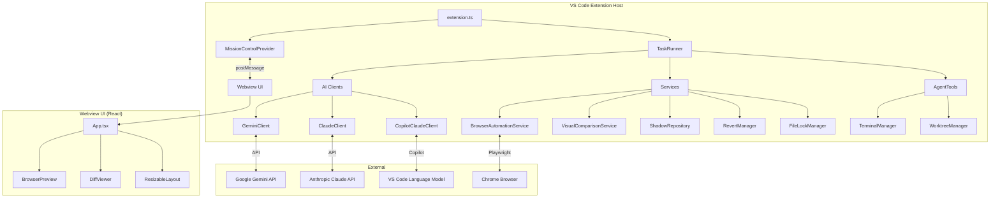
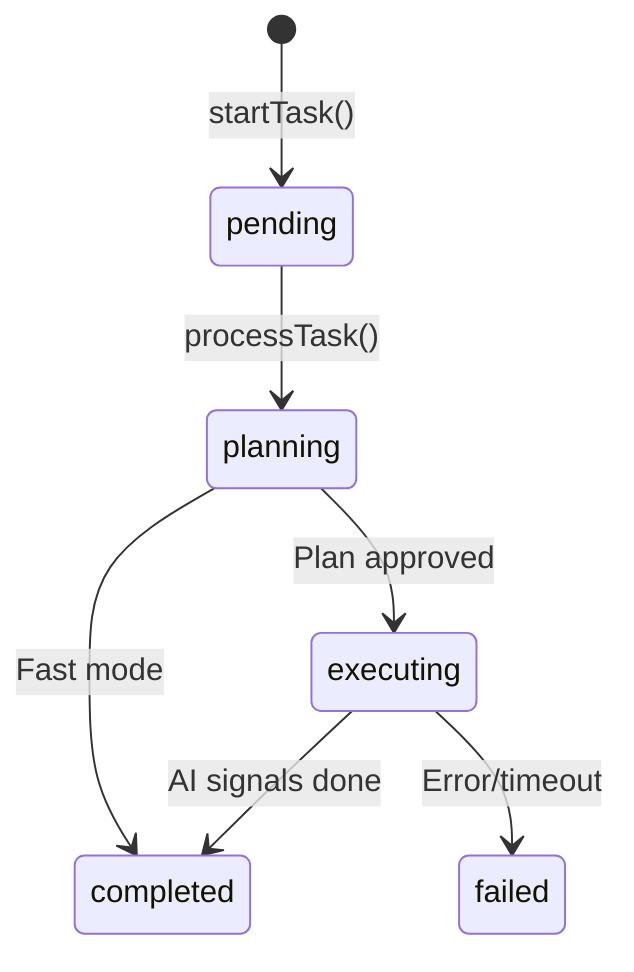
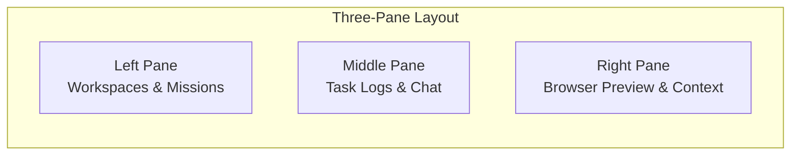
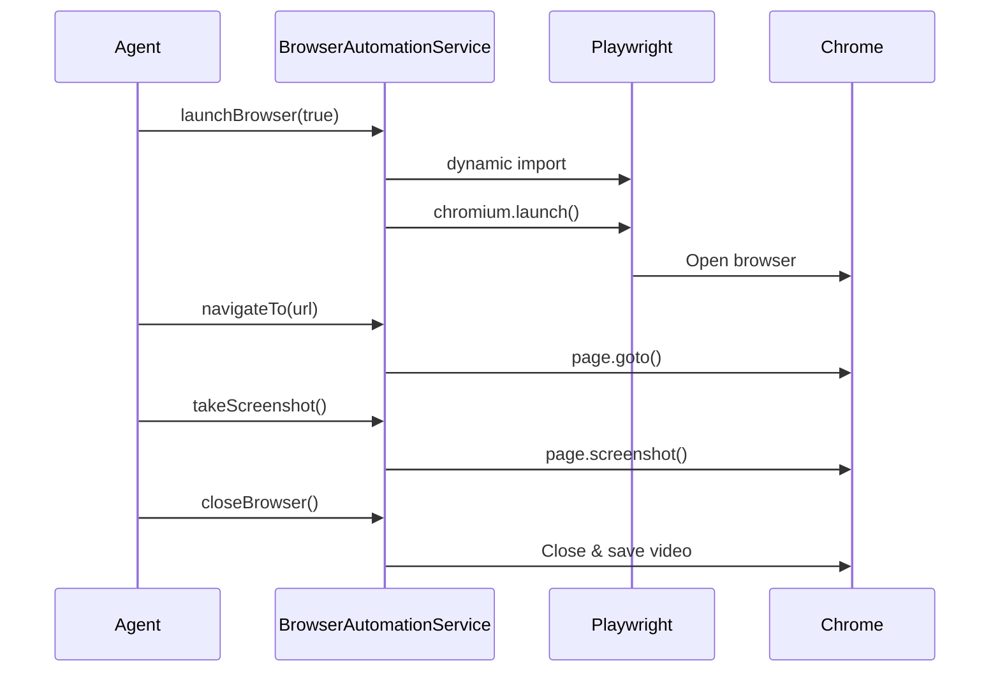
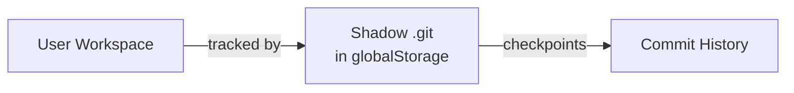
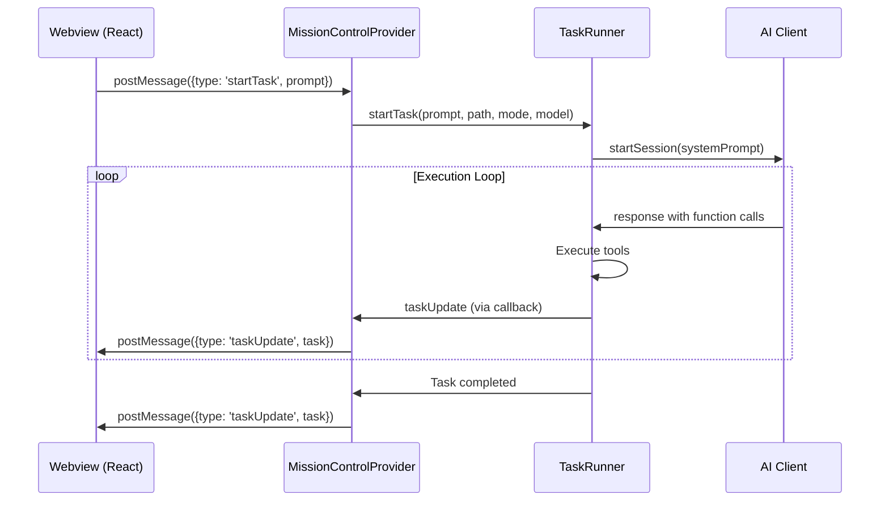
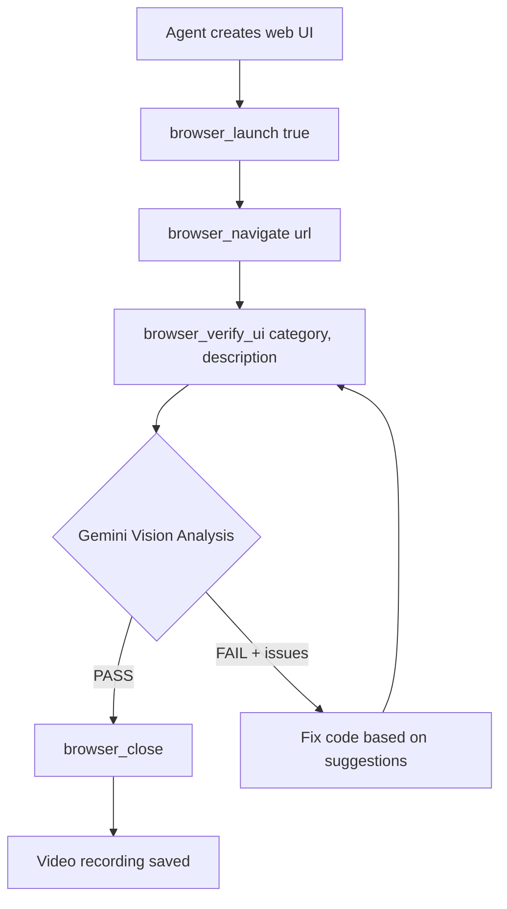
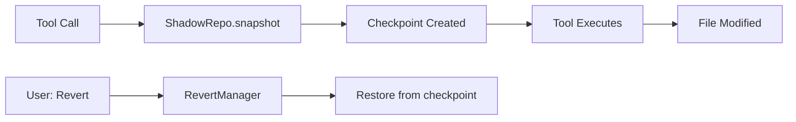

# VibeArchitect Architecture Documentation

A comprehensive technical guide to the VibeArchitect VS Code extension - an AI-powered coding agent with browser automation and self-healing capabilities.

---

## Table of Contents
1. [High-Level Architecture](#high-level-architecture)
2. [Backend (Extension Host)](#backend-extension-host)
3. [Frontend (Webview UI)](#frontend-webview-ui)
4. [AI Clients](#ai-clients)
5. [Services](#services)
6. [Data Flow](#data-flow)
7. [Key Workflows](#key-workflows)

---

## High-Level Architecture



---

## Backend (Extension Host)

### Entry Point: `extension.ts`

| Function | Description |
|----------|-------------|
| `activate(context)` | Extension activation - creates TaskRunner, registers commands |
| `deactivate()` | Cleanup on extension deactivation |

**Registered Commands:**
- `vibearchitect.openMissionControl` - Opens the main UI panel

---

### MissionControlProvider

**Path:** `src/panels/MissionControlProvider.ts`

The webview panel host - manages communication between extension and React UI.

| Method | Description |
|--------|-------------|
| `createOrShow()` | Creates or reveals the webview panel |
| `constructor()` | Sets up panel, loads persisted workspaces/tasks |
| `_setWebviewMessageListener()` | Handles messages from webview |
| `_getWebviewContent()` | Returns HTML with bundled React app |
| `saveWorkspaces()` | Persists workspaces to globalState |
| `sendWorkspaces()` | Sends workspace list to webview |

**Message Types Handled:**
- `addWorkspace`, `removeWorkspace` - Workspace management
- `startTask` - Initiates new agent task
- `replyToTask` - User follow-up message
- `changeModel` - Switch AI model mid-task
- `revertToCheckpoint` - Revert file changes
- `openFile`, `openDiff` - File operations
- `refreshPreview`, `navigatePreview` - Browser preview control

---

### TaskRunner

**Path:** `src/engine/TaskRunner.ts`

The execution engine - orchestrates AI sessions, tool execution, and task lifecycle.



| Method | Description |
|--------|-------------|
| `startTask(prompt, path, mode, model)` | Creates new task, returns taskId |
| `processTask(taskId)` | Main processing - creates AI session, runs loop |
| `runExecutionLoop(taskId, chat, tools)` | Tool execution loop - sends messages, executes tools |
| `changeModel(taskId, newModel)` | Hot-swap AI model mid-task |
| `replyToTask(taskId, message)` | Process user follow-up message |
| `revertTask(taskId, checkpointId)` | Revert to checkpoint using ShadowRepository |
| `loadTasks()` / `saveTask()` | Task persistence |
| `buildContextFromTask(task)` | Rebuilds context for session restoration |

**Key Interfaces:**

```typescript
interface AgentTask {
    id: string;
    prompt: string;
    status: 'pending' | 'planning' | 'executing' | 'completed' | 'failed';
    progress: number;
    logs: string[];
    worktreePath?: string;
    chat: { role: 'user' | 'assistant', text: string }[];
    artifacts: string[];
    mode?: 'planning' | 'fast';
    model?: string;
    checkpoints?: { id: string, message: string, timestamp: number }[];
    fileEdits?: FileEdit[];
}
```

---

### AgentTools

**Path:** `src/engine/AgentTools.ts`

Provides all tools available to AI agents.

| Category | Methods |
|----------|---------|
| **File Operations** | `readFile()`, `writeFile()`, `listFiles()` |
| **Commands** | `runCommand()` |
| **Web Search** | `searchWeb()` |
| **Simple Preview** | `reload_browser()`, `navigate_browser()` |
| **Browser Automation** | `browserLaunch()`, `browserNavigate()`, `browserScreenshot()`, `browserClick()`, `browserType()`, `browserWaitFor()`, `browserGetDOM()`, `browserReload()`, `browserEvaluate()`, `browserClose()` |
| **UI Verification** | `browserVerifyUI()` - Uses Gemini Vision for semantic analysis |
| **Status Checks** | `isBrowserRunning()`, `isBrowserRecording()` |

---

## Frontend (Webview UI)

### App.tsx

**Path:** `webview-ui/src/App.tsx` (899 lines)

Main React application with three-pane layout.



| Function/Hook | Description |
|---------------|-------------|
| `App()` | Main component - manages all state |
| `parseLogs()` | Parses raw log strings into structured LogGroup objects |
| `messageHandler()` | Handles messages from extension (task updates, etc.) |
| `handleStartTask()` | Sends startTask message to extension |
| `handleNewChat()` | Resets for new conversation |

**Key State:**
- `workspaces[]` - Workspace list
- `missions[]` - Task/mission list
- `selectedMission` - Current active mission
- `logs[]` - Raw log strings
- `parsedLogs[]` - Structured log groups
- `previewUrl` - URL for browser preview
- `previewContent` - Artifact content for right pane

### Components

| Component | Path | Description |
|-----------|------|-------------|
| **BrowserPreview** | `components/BrowserPreview.tsx` | Embedded iframe for live web preview |
| **DiffViewer** | `components/DiffViewer.tsx` | GitHub-style diff display with +/- highlighting |
| **ResizableLayout** | `components/ResizableLayout.tsx` | Three-pane resizable layout with drag handles |

---

## AI Clients

### GeminiClient

**Path:** `src/ai/GeminiClient.ts`

Primary AI client using Google's Gemini API.

| Method | Description |
|--------|-------------|
| `constructor(apiKey, modelName)` | Initialize with API key |
| `startSession(systemPrompt, thinkingLevel)` | Creates chat session with tool definitions |
| `research(query)` | Web search using Gemini grounding |
| `analyzeScreenshot(base64, mime, description, mission)` | **Vision API** - Semantic UI verification |

**Tool Declarations (14 tools):**
`read_file`, `write_file`, `list_files`, `run_command`, `reload_browser`, `navigate_browser`, `search_web`, `browser_launch`, `browser_navigate`, `browser_screenshot`, `browser_click`, `browser_type`, `browser_wait_for`, `browser_get_dom`, `browser_verify_ui`, `browser_close`

### ClaudeClient

**Path:** `src/ai/ClaudeClient.ts`

Anthropic Claude API client with same tool definitions as Gemini.

| Method | Description |
|--------|-------------|
| `startSession(systemPrompt, thinkingLevel)` | Creates session with tool_use capability |
| `sendMessage(prompt)` | Handles multi-turn with tool_use blocks |

### CopilotClaudeClient

**Path:** `src/ai/CopilotClaudeClient.ts`

Uses VS Code's Language Model API for Claude via GitHub Copilot subscription.

| Method | Description |
|--------|-------------|
| `startSession(systemPrompt)` | Uses `vscode.lm.selectChatModels()` |
| Text parsing workaround | Extracts tool calls from text (no native function calling) |

---

## Services

### BrowserAutomationService

**Path:** `src/services/BrowserAutomationService.ts`

Playwright-based browser control for automated UI testing.



| Method | Description |
|--------|-------------|
| `launchBrowser(recordVideo)` | Launch Chrome with optional video recording |
| `navigateTo(url)` | Navigate with networkidle wait |
| `takeScreenshot(name)` | Full-page screenshot |
| `click(selector)` / `type(selector, text)` | Page interaction |
| `waitForSelector(selector, timeout)` | Wait for element |
| `getPageContent()` | Capture DOM HTML |
| `closeBrowser()` | Close and return RecordingResult |

### VisualComparisonService

**Path:** `src/services/VisualComparisonService.ts`

Pixel-level screenshot comparison using pixelmatch.

| Method | Description |
|--------|-------------|
| `compareScreenshots(baseline, current, diffPath)` | Pixel diff comparison |
| `saveBaseline(path, category)` | Save as baseline for future comparisons |
| `compareAgainstBaseline(current, category)` | Compare current against saved baseline |
| `analyzeScreenshotForIssues(path)` | Basic issue detection (blank pages, errors) |

### ShadowRepository

**Path:** `src/services/ShadowRepository.ts`

Invisible Git repository for workspace checkpointing.



| Method | Description |
|--------|-------------|
| `initialize()` | Create shadow git repo with `--separate-git-dir` |
| `snapshot(message)` | Create checkpoint commit |
| `getHistory()` | Get checkpoint history |
| `configureExclusions()` | Setup .gitignore (node_modules, etc.) |

### RevertManager

**Path:** `src/services/RevertManager.ts`

Handles file reversion to checkpoints.

| Method | Description |
|--------|-------------|
| `revertToCheckpoint(checkpointId)` | Restore files to checkpoint state |
| `getFileDiff(checkpointId, filePath)` | Get diff between current and checkpoint |

### FileLockManager

**Path:** `src/services/FileLockManager.ts`

Prevents concurrent file modifications by multiple agents.

| Method | Description |
|--------|-------------|
| `acquireLock(path, taskId)` | Lock file for exclusive access |
| `releaseLock(path, taskId)` | Release file lock |
| `isLocked(path)` | Check if file is locked |

---

## Data Flow

### Message Flow: Extension ↔ Webview



---

## Key Workflows

### 1. Self-Healing UI Verification



### 2. Task Checkpoint & Revert



---

## File Structure

```
Antigravity-Manager-Ext/
├── src/
│   ├── extension.ts                 # Entry point
│   ├── ai/
│   │   ├── GeminiClient.ts          # Gemini API + Vision
│   │   ├── ClaudeClient.ts          # Anthropic API
│   │   ├── CopilotClaudeClient.ts   # VS Code LM API
│   │   └── PromptEngine.ts          # Prompt templates
│   ├── engine/
│   │   ├── TaskRunner.ts            # Execution engine
│   │   ├── AgentTools.ts            # Tool implementations
│   │   ├── TerminalManager.ts       # Terminal sessions
│   │   └── WorktreeManager.ts       # Git worktrees
│   ├── panels/
│   │   └── MissionControlProvider.ts # Webview host
│   └── services/
│       ├── BrowserAutomationService.ts  # Playwright
│       ├── VisualComparisonService.ts   # pixelmatch
│       ├── ShadowRepository.ts          # Git checkpoints
│       ├── RevertManager.ts             # Checkpoint revert
│       └── FileLockManager.ts           # Concurrent access
├── webview-ui/
│   └── src/
│       ├── App.tsx                  # Main React app
│       ├── App.css                  # Styles
│       ├── components/
│       │   ├── BrowserPreview.tsx   # Live preview iframe
│       │   ├── DiffViewer.tsx       # Git diff display
│       │   └── ResizableLayout.tsx  # Three-pane layout
│       └── utilities/
│           └── vscode.ts            # postMessage wrapper
├── package.json                     # Dependencies & config
├── webpack.config.js                # Build configuration
└── SETUP_GUIDE.md                   # Installation guide
```

---

## Configuration Options

| Setting | Type | Description |
|---------|------|-------------|
| `vibearchitect.geminiApiKey` | string | Google Gemini API key |
| `vibearchitect.claudeApiKey` | string | Anthropic Claude API key |
| `vibearchitect.useCopilotForClaude` | boolean | Use Copilot subscription for Claude |
| `vibearchitect.browserRecordingsPath` | string | Custom path for video recordings |
| `vibearchitect.browserSelfHealingRetries` | number | Max self-healing attempts (default: 3) |

---

## Dependencies

### Extension (Backend)
| Package | Purpose |
|---------|---------|
| `@google/generative-ai` | Gemini API client |
| `@anthropic-ai/sdk` | Claude API client |
| `simple-git` | Git operations for ShadowRepository |
| `fs-extra` | Enhanced file operations |
| `playwright-core` | Browser automation (optional) |
| `pixelmatch` | Image comparison (optional) |
| `pngjs` | PNG processing (optional) |

### Webview (Frontend)
| Package | Purpose |
|---------|---------|
| `react` | UI framework |
| `react-markdown` | Markdown rendering |
| `esbuild` | Fast bundling |

---

*Last updated: December 2024*
